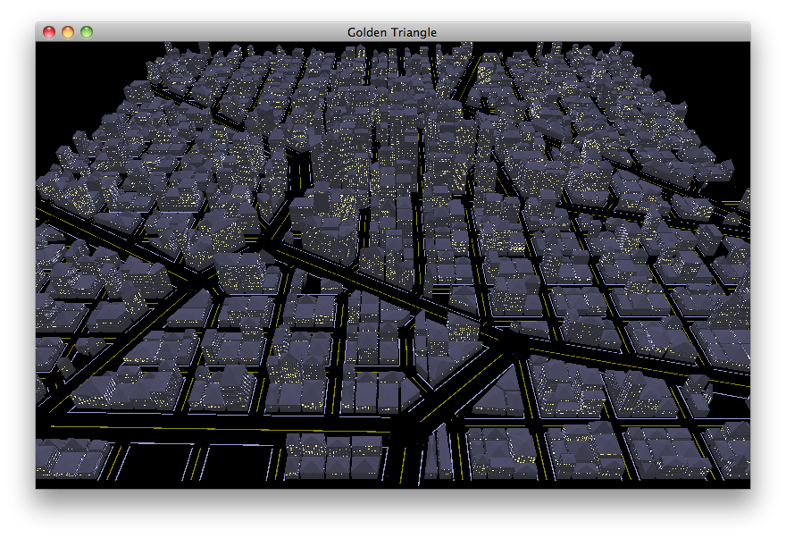

# OrganicCity
A procedural generated city that grows and changes organically over time. The buildings grow and change depending on those around them and the general growth of the city affects the envrionment around it.

# My Vision
I initally set out with the goal of building a city generator that would build everything randomnly according to a set a pre-defined rules. The buildings would vary in size, height and density and the road network would change according to where the buildings were and how they built. I wanted something more than that though and decided on bringing the city to life, literally. I wanted the city to grow and develop and impact other buildings around it as well as have a green space or envrionment that would evolve alongside the city. The rules that would govern this evolution would be similar to [Conway's Game of Life](http://www.conwaylife.com/w/index.php?title=Conway%27s_Game_of_Life) in the sense that there would be a set of rules that would dictate the dynamic of how the city would grow and develop.


The first thing I did after deciding on my idea was to start researching other city generators that already exist and see how they achieved their generation. The first one I came accross was a simple 2D generator that generactes roads and buildings. The roads can form into intersections and junctions and those affect roads around them by lengthing or shortening them depending on the nearest juntion or intersection. Then the population density would also be taken into account when the road was making a decision of where to extend to. The A* was used for pathfinding and the algorithm below was the driving force behind the generation.

Source:https://www.tmwhere.com/city_generation.html

```
initialize priority queue Q with a single entry: r(0, r0, q0)
initialize segment list S to empty

until Q is empty
  pop smallest r(ti, ri, qi) from Q
  accepted = localConstraints(&r)
  if (accepted) {
    add segment(ri) to S
    foreach r(tj, rj, qj) produced by globalGoals(ri, qi)
      add r(ti + 1 + tj, rj, qj) to Q
  }
  ```
  *"r is a road segment with parameters: ti - the time delay until the segment is placed in the world, ri - the geometrical properties of the segment, and qi - any additional metadata associated with the segment. Q is a list of segments yet to be placed in the world. In each iteration of the algorithm the segment with the smallest ti is removed from Q. localConstraints checks the segment for compatibility with all previously placed segments and may modify its geometry if necessary, for example to join the end of the segment to a nearby junction.*

*If the segment is found to be compatible, it is added to the list of placed segments S. The newly placed segment is then fed into globalGoals which decides what, if any, new segments should branch out from it in the future. The implementation of globalGoals is entirely up to the developer: I made the decision for roads to simply tend towards areas of high population density. The original authors added further constraints to create several distinctive categories of road patterns.*

*The behaviour of the algorithm can be visualised by turning on the debug view in the demonstration above. The highlighted path shows the order that segments are placed. Segments can be seen branching out from the main highways, and merging with parallel areas of growth as dictated by the local constraints. The consequence of queueing the segments by ti can also be seen, causing the network to grow roughly uniformly across its circumference and leaving no dangling segment inactive for long."*



Source:https://pjreddie.com/projects/procedural-city-generation/
  
The other city generator I found was a 3D one which focused more on the buildings than the roads, dividing an area into sectors and then subdividing those sectors and applying rules onto them to decide the height, size, light number and density of the buildings. The divisions of the sectors was done using randomnly placed control points and these formed the roads and then things such as stop signs and traffic lights were added around their cities.

After looking at these two projects I felt I had a reasonable start point, I know how I wanted the city to grow and evolve and as a side-effect how the envrionment around it would change and develop, I also have an idea of the maths behind actually generating the city and how to map out the buildings and the roads themselves.
